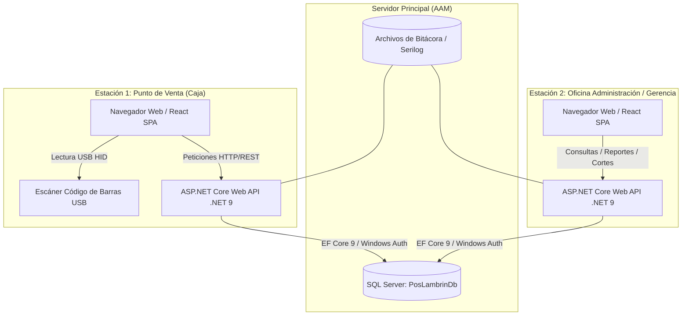
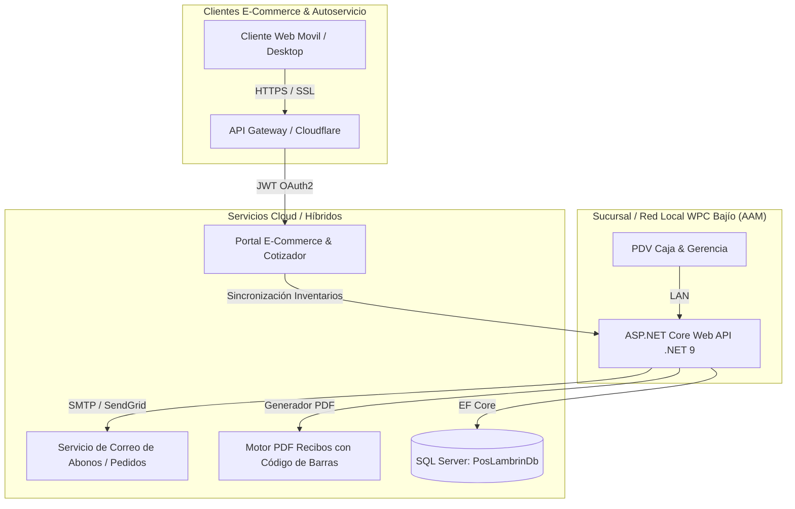

# DIAGRAMAS DE ARQUITECTURA Y COMPONENTES — WPC BAJÍO

Este documento contiene las especificaciones técnicas completas de arquitectura y componentes para la **Fase 1 (Sistema Interno y PDV)** y **Fase 2 (Plataforma E-Commerce y Portal de Clientes)** del proyecto **WPC Bajío**, preparadas para renderizarse sin consumo adicional de tokens.

---

## 1. DIAGRAMA DE ARQUITECTURA — FASE 1 (Sistema Interno & PDV en Red Local)

La Fase 1 contempla una instalación en Red Local (LAN) con 2 estaciones de trabajo conectadas a la base de datos SQL Server en el servidor `AAM`.



---

## 2. DIAGRAMA DE ARQUITECTURA — FASE 2 (E-Commerce y Portal de Atención al Cliente)

La Fase 2 extiende el ecosistema conectando la tienda en línea y portal cliente con el backend central a través de servicios seguros en la nube.



---

## 3. DIAGRAMA DE COMPONENTES — FASE 1

```mermaid
componentDiagram
    package "Frontend pos-web (React + Vite + TypeScript)" {
        [PaginaPuntoVenta]
        [PaginaCatalogoProductos]
        [PaginaInventario]
        [PaginaTurnoCaja]
        [PaginaReportes]
        [usarEscanerCodigoBarras]
    }

    package "Backend ASP.NET Core (.NET 9)" {
        [ControladorVentas]
        [ControladorProductos]
        [ControladorTurnoCaja]
        [ControladorReportes]
        
        [ServicioVentas]
        [ServicioCatalogo]
        [ServicioTurnoCaja]
        [ServicioBitacoraAuditoria]
        
        [DbContextPos]
    }

    database "Base de Datos" {
        [SQL Server AAM]
    }

    [PaginaPuntoVenta] --> [ControladorVentas]
    [PaginaCatalogoProductos] --> [ControladorProductos]
    [PaginaTurnoCaja] --> [ControladorTurnoCaja]
    [PaginaReportes] --> [ControladorReportes]

    [ControladorVentas] --> [ServicioVentas]
    [ControladorProductos] --> [ServicioCatalogo]
    [ControladorTurnoCaja] --> [ServicioTurnoCaja]

    [ServicioVentas] --> [ServicioBitacoraAuditoria]
    [ServicioVentas] --> [DbContextPos]
    [ServicioTurnoCaja] --> [DbContextPos]
    [DbContextPos] --> [SQL Server AAM]
```

---

## 4. DIAGRAMA DE COMPONENTES — FASE 2

```mermaid
componentDiagram
    package "Portal E-Commerce Clientes" {
        [CatalogoPublicoWeb]
        [CotizadorAutoservicio]
        [ConsultaAbonosCliente]
    }

    package "Servicios Extendidos Backend" {
        [ControladorECommerce]
        [ServicioNotificacionesCorreo]
        [ServicioGeneradorPdfCodigoBarras]
        [ServicioPagosElectronicos]
    }

    package "Base de Datos Central" {
        [SQL Server AAM]
    }

    [CatalogoPublicoWeb] --> [ControladorECommerce]
    [CotizadorAutoservicio] --> [ControladorECommerce]
    [ConsultaAbonosCliente] --> [ServicioGeneradorPdfCodigoBarras]

    [ControladorECommerce] --> [ServicioPagosElectronicos]
    [ControladorECommerce] --> [ServicioNotificacionesCorreo]
    [ServicioPagosElectronicos] --> [SQL Server AAM]
```
